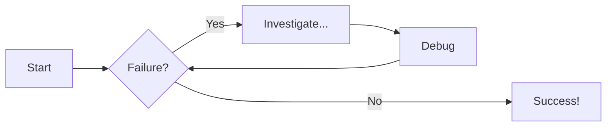
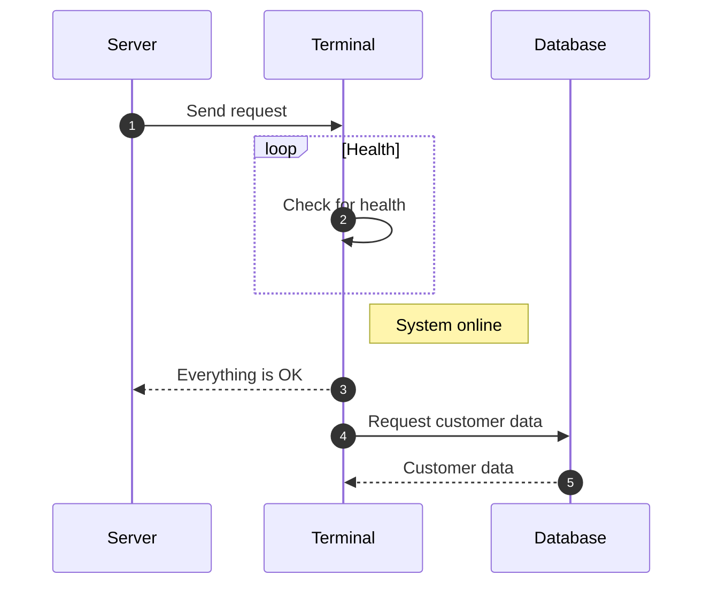
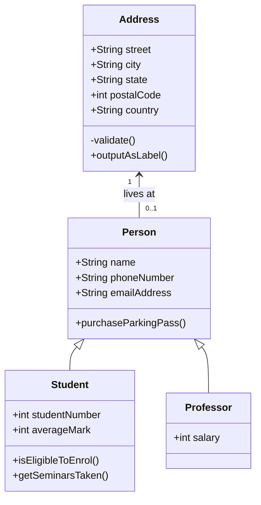

# Diagram Examples

## Flowcharts

## Sequence Diagrams

## definitely look into class diagram

Another link: <https://squidfunk.github.io/mkdocs-material/reference/diagrams/#using-state-diagrams>