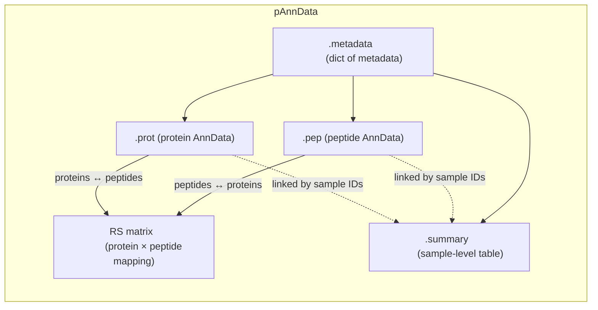
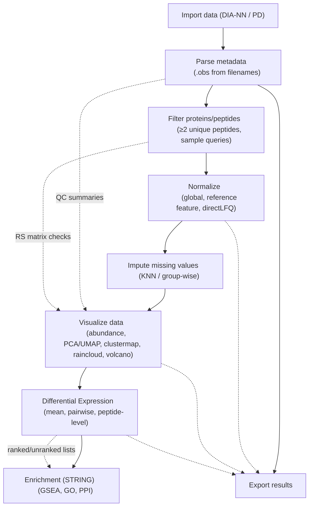

# `pAnnData` Overview

The `pAnnData` object is the central data container in **scviz**, extending the [AnnData](https://anndata.readthedocs.io/) structure for single-cell and bulk proteomics.  
It integrates matched **protein-level** and **peptide-level** matrices, along with metadata, summaries, and a protein–peptide relational structure (RS matrix).

This page introduces the core design of `pAnnData` and shows how to import data from supported formats.

!!! info "Key Features"
    - Matched `AnnData` objects for proteins (`.prot`) and peptides (`.pep`)
    - Support for multiple layers (raw, normalized, imputed, etc.)
    - Integrated metadata (`.metadata`) and summary tables (`.summary`)
    - Tracking of filtering, normalization, and analysis history
    - Compatible with all scviz modules (plotting, enrichment, filtering, etc.)



## Importing Data

Data can be imported into `pAnnData` directly from DIA-NN, Proteome Discoverer, or other supported formats:

```python
from scviz import pAnnData as pAnnData
from scviz import plotting as scplt
from scviz import utils as scutils

# From DIA-NN report
pdata = pAnnData.import_data(source_type='diann', report_file ="report.tsv")

# From Proteome Discoverer output
pdata = pAnnData.import_data(source_type='pd', prot_file ="proteomediscoverer_prot.txt", pept_file ="proteomediscoverer_pep.txt")
```

Once imported, the `pAnnData` object serves as the entry point for downstream workflows:
filtering, normalization, imputation, visualization, and enrichment analysis.

## Workflow Pipeline

The `pAnnData` object enables a modular analysis pipeline for single-cell and bulk proteomics.  
Each step builds on the previous one, but you can skip or repeat steps depending on your dataset and analysis goals.



!!! tip "Tutorials"
    Each step of the pipeline is explained in detail in the [tutorials](../tutorials/index.md):

    - [Importing and Exporting Data](../tutorials/importing.md)
    - [Filtering ](../tutorials/filtering.md)  
    - [Imputation + Normalization](../tutorials/imputation.md)  
    - [Plotting](../tutorials/plotting.md)
    - [Differential Expression](../tutorials/de.md)  
    - [Enrichment + Networks](../tutorials/enrichment.md)  

    For a guided introduction, start with the [Quickstart](../tutorials/quickstart.md).  

---

## Modules  

In addition to the core `pAnnData` class, **scviz** provides two standalone modules that support analysis and visualization:  

- **`scviz.utils`**  
  A collection of helper functions for data processing, filtering, formatting, and interacting with external resources such as UniProt.  
  These functions are primarily used internally but can also be useful for advanced users who need finer control over their workflows.  

- **`scviz.plotting`**  
  A set of high-level visualization utilities designed to work seamlessly with `pAnnData`.  
  Functions include abundance plots, rank plots, raincloud plots, clustermaps, UMAP/PCA projections, and UpSet diagrams.  
  Each plotting function is designed to accept a `matplotlib.axes.Axes` object for flexible integration into custom figure layouts.  

---

## Developer Utilities  

**scviz** also includes a small set of developer-focused tools that help maintain consistency and internal state:  

- **`TrackedDataFrame`**  
  A subclass of `pandas.DataFrame` that marks its parent `pAnnData` object as “stale” whenever it is modified directly.  
  This ensures that summary tables and metadata stay consistent with the main data layers.  

- **Hidden functions**  
  Internal helpers that are not part of the standard API.  
  These are documented for completeness but should generally not be used directly in analysis workflows.  

!!! warning "Developer utilities"  
    These tools are included for package maintainers and power users.  
    Most end-users will not need to interact with them directly.  

---

👉 For hands-on examples of using the core class and modules in practice, see the [Tutorials](../tutorials/index.md).  
