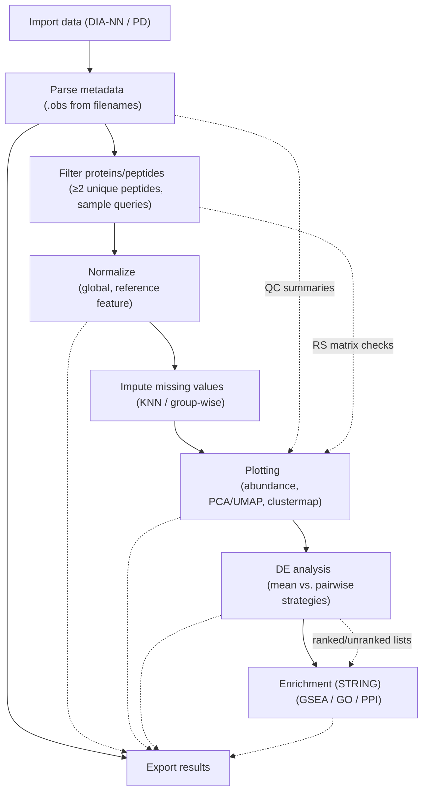

# Tutorials

Welcome to the **scpviz tutorials**.
These guides walk you through the main steps of a single-cell or spatial proteomics workflow using `pAnnData`.  

---

## How to Use These Tutorials

Each tutorial is designed to be self-contained, with code snippets you can run in a Python environment.

Each tutorial includes:

- Example code blocks you can copy into a Jupyter notebook.  
- Visual outputs to illustrate the results.  
- Tips and notes to explain recommended practices.  

If you’re new to **scpviz**, start with [**Importing Data**](importing.md) and work through the sequence.  

## Workflow at a Glance

---
### 1. [Importing Data](importing.md)
- Load DIA-NN or Proteome Discoverer (PD) reports into `pAnnData`.
- Automatically parse sample metadata (`.obs`) from filenames.
- Understand the `prot`, `pep`, and `rs` matrices.

### 2. [Filtering and Normalization](filtering.md)
- Filter proteins by peptide support (e.g. ≥2 unique peptides).
- Apply sample-level filters and advanced queries on `.obs` or `.summary`.
- Normalize intensities by global scale, reference features, or other strategies.

### 3. [Imputation](imputation.md)
- Handle missing values using KNN-based or group-wise strategies.
- Summarize imputation statistics stored in `pdata.stats`.

### 4. [Plotting](plotting.md)
- Visualize abundance distributions with violin/box/strip plots.
- Run PCA/UMAP embeddings with flexible coloring options.
- Generate heatmaps and clustermaps with class annotations.

### 5. [Differential Expression (DE)](de.md)
- Perform DE testing at the protein or peptide level.
- Compare fold-change strategies (mean-based vs. pairwise median).
- Export DE results for downstream use.

### 6. [Enrichment and Networks](enrichment.md)
- Run GSEA and GO enrichment with [STRING](https://string-db.org/).
- Explore protein–protein interaction networks.
- Retrieve functional annotations for differentially expressed genes.

---

*For in-depth details, see the [API Reference](../reference/index.md).*
