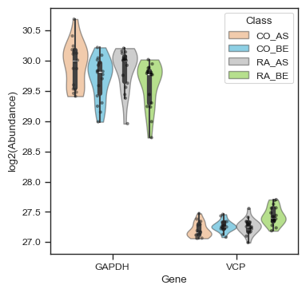
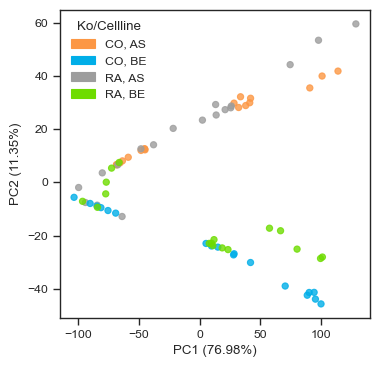
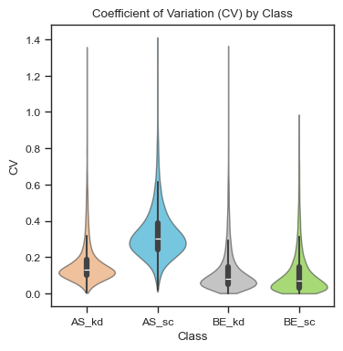
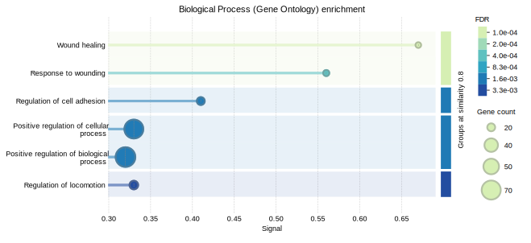

# Quickstart

[](https://github.com/gnaprs/scpviz/raw/main/docs/tutorials/quickstart.ipynb)
[](https://colab.research.google.com/github/gnaprs/scpviz/blob/main/docs/tutorials/quickstart.ipynb)

This quickstart tutorial demonstrates a minimal end-to-end workflow using **scpviz**.

First, install `scpviz` and import the modules:

```py
!pip install scpviz
```


```py
from scpviz import pAnnData as pAnnData
from scpviz import plotting as scplt
from scpviz import utils as scutils
```

---

## Import

Proteomics data is stored in a `pAnnData` object. `scpviz` currently supports two data formats: **Proteome Discoverer** (Thermo Fisher) and **DIA-NN** reports. We’ve provided sample test files below so you can follow along:

[](https://github.com/gnaprs/scpviz/raw/main/docs/assets/pd32_Proteins.txt)
[](https://github.com/gnaprs/scpviz/raw/main/docs/assets/pd32_PeptideSequenceGroups.txt)
[](https://github.com/gnaprs/scpviz/raw/main/docs/assets/diann_report.parquet)

=== "Proteome Discoverer"

    ``` py title="Import Proteome Discoverer data"
    obs_columns = ['Sample','cellline','treatment','condition','duration']
    pdata = pAnnData.import_data(
        source_type='pd', 
        prot_file = 'pd_prot.txt', 
        pep_file='pd32_PeptideSequenceGroups.txt',
        obs_columns=obs_columns)
    ```

    <div class="result" markdown>

    ```text title="output"
    🧭 [USER] Importing data of type [pd]
    --------------------------
    Starting import [Proteome Discoverer]

    Source file: ../assets/pd32_Proteins.txt / ../assets/pd32_PeptideSequenceGroups.txt
    Number of files: 12
    Proteins: 10393
    Peptides: 167114
        ...
        ✅ [OK] pAnnData object is valid.
        ✅ [OK] Import complete. Use `print(pdata)` to view the object.
    --------------------------
    ```

    </div>

=== "DIA-NN"

    ``` py title="Import DIA-NN data"
    obs_columns = ['user', 'date', 'ms', 'acquisition', 'faims', 'column', 'gradient', 'amount', 'region', 'rep']
    pdata = pAnnData.import_data(
        source_type='diann', 
        report_file = 'diann_report.parquet', 
        obs_columns=obs_columns)
    ```

    <div class="result" markdown>

    ```text title="output"
    🧭 [USER] Importing data of type [diann]
    --------------------------
    Starting import [DIA-NN]

    Source file: ../assets/diann_report.parquet
    Number of files: 12
    Proteins: 12652
    Peptides: 251047
        ...
        ✅ [OK] pAnnData object is valid.
        ✅ [OK] Import complete. Use `print(pdata)` to view the object.
    --------------------------
    ```

    </div>

!!! note
    Refer to the [Importing Data](importing.md) tutorial for more options, including defining metadata columns.

We can have a quick look at our `pdata` object by checking `pdata.summary`:

``` py title="Checking pdata.summary"
pdata.summary
```

<div class="result" markdown>

| Sample | cellline | treatment | condition | duration | ... | protein_count | ... | peptide_count | ... |
|:------:|:---------:|:----------:|:-----------:|:----------:|:--:|---------------:|:--:|---------------:|:--:|
| F4 | AS | RA | kd | d7 | … | 9660 | … | 139793 | … |
| F23 | BE | RA | sc | d7 | … | 1724 | … | 4534 | … |
| F24 | BE | RA | sc | d7 | … | 9748 | … | 133675 | … |

</div>

---

## Pre-processing

### Filtering

File **F23** shows a markedly low protein count (~1700) compared to ~9000 in all other samples.
This file is an outlier and should be removed prior to downstream analysis.

Two filtering approaches can be used to achieve the same result:

=== "Filter by protein count"

    ``` py title="Filter by minimum protein count"
    pdata = pdata.filter_sample(min_prot=8000)
    ```

    <div class="result" markdown>

    ``` text title="output"
    🧭 [USER] Filtering samples [condition]:
        Returning a copy of sample data based on condition:
        🔸 Condition: protein_count >= 8000
        ℹ️ Auto-cleanup: No empty proteins found (all-NaN or all-zero).
        → Samples kept: 11, Samples dropped: 1
        → Proteins kept: 10393
    ```

    </div>

=== "Exclude by filename"

    ``` py title="Filter by excluding specific file"
    pdata = pdata.filter_sample(exclude_file_list=['F23'])
    ```

    <div class="result" markdown>

    ``` text title="output"
    🧭 [USER] Filtering samples [file list]:
        Returning a copy of sample data based on file list:
        🔸 Files requested (excluding): 1
        ℹ️ Auto-cleanup: No empty proteins found (all-NaN or all-zero).
        → Samples kept: 11, Samples dropped: 1
        → Proteins kept: 10393
    ```

    </div>

After filtering, the dataset now contains **11 samples**.  

!!! note
    All filter functions return a **copy** of the `pAnnData` object unless `inplace=True` is specified.  
    See the [Filtering](filtering.md) tutorial for more options.

### Quick visualization

Visualize proteins of interest across samples:

```py title="Plot protein abundance"
import matplotlib.pyplot as plt

fig, ax = plt.subplots(figsize=(4,4))
pdata.plot_abundance(ax, namelist=["GAPDH", "VCP", "AHNAK"], classes=["cellline","condition"])
plt.show()
```

<div class="result" markdown>
<figure markdown="span">

<figcaption>Protein abundance visualization for selected proteins.</figcaption>
</figure>

</div>

---

Alternatively, we can explore the PCA embeddings to get an overview of sample clustering.
Other dimensionality reduction methods such as UMAP and t-SNE can also be used.

```py title="Plot PCA embeddings"
fig, ax = plt.subplots(figsize = (4,4))
ax = scplt.plot_pca(ax, pdata, classes=["cellline","condition"], add_ellipses=True)
```

<div class="result" markdown>
<figure markdown="span">
  
  <figcaption></figcaption>
</figure>

</div>

The samples appear well-clustered by both cell line and condition, suggesting good reproducibility and biological separation.

---

Finally, we can examine the coefficient of variation (CV) of each sample.
Here, the samples show overall low variability (median ~0.1), with slightly higher CVs observed in the AS_sc group (~0.35).

```py title="Plot sample CVs"
fig, ax = plt.subplots(figsize = (4,4))
ax = scplt.plot_cv(ax, pdata, classes=["cellline","condition"])
```

<div class="result" markdown>
<figure markdown="span">
  
  <figcaption></figcaption>
</figure>

</div>

!!! note
    Refer to the [plotting](plotting.md) tutorial for more advanced plotting options.

---

### Normalization and Imputation

Biological and technical variation across samples (e.g., in the AS_sc group) can arise from sample processing or data acquisition. Normalize your data to reduce variation between samples — for example, using median scaling.  


``` py title="Normalization and imputation"
pdata.normalize(method="median")
pdata.impute(method="min")
```

<div class="result" markdown>

```text title="output"
🧭 [USER] Global normalization using 'median'. Layer will be saved as 'X_norm_median'.
     ✅ Normalized all 11 samples.
     ℹ️ Set protein data to layer X_norm_median.
🧭 [USER] Global imputation using 'min'. Layer saved as 'X_impute_min'. Minimum scaled by 1.
     ✅ 8234 values imputed.
     ℹ️ 11 samples fully imputed, 0 samples partially imputed, 0 skipped feature(s) with all missing values.
     ℹ️ Set protein data to layer X_impute_min.
```

</div>

After normalization, CVs for the **AS_sc** group improve compared to pre-normalized data.

```py title="Plot sample CVs after normalization"
fig, ax = plt.subplots(figsize = (4,4))
ax = scplt.plot_cv(ax, pdata, classes=["cellline","condition"])
```

<div class="result" markdown>
<figure markdown="span">
  
  <figcaption>Sample-wise CVs after normalization and imputation.</figcaption>
</figure>

</div>

Other imputation methods are also available, including KNN, median, and minimum with a scaling factor. 

!!! note
    Refer to the [Normalization & Imputation](imputation.md) tutorial for additional examples and parameter options, such as Harmony or DirectLFQ.

## Differential expression

### Volcano Plots

Run a **differential expression (DE)** analysis, commonly visualized with volcano plots. To start, we define a *comparison ratio*: for instance, comparing cell line BE under the kd condition against cell line BE under sc.

```py title="Differentiatial expression with volcano plots"
fig, ax = plt.subplots(figsize=(4,4))
comparison_values=[{'cellline':'BE', 'condition':'kd'},{'cellline':'BE', 'condition':'sc'}]
ax = scplt.plot_volcano(ax, pdata, values=comparison_values)
```

<div class="result" markdown>

```text title="output" hl_lines="7"
🧭 [USER] Running differential expression [protein]
   🔸 Comparing groups: [{'cellline': 'BE', 'condition': 'kd'}] vs [{'cellline': 'BE', 'condition': 'sc'}]
   🔸 Group sizes: 3 vs 2 samples
   🔸 Method: ttest | Fold Change: mean | Layer: X
   🔸 P-value threshold: 0.05 | Log2FC threshold: 1
     ✅ DE complete. Results stored in:
       • .stats["[{'cellline': 'BE', 'condition': 'kd'}] vs [{'cellline': 'BE', 'condition': 'sc'}]"]
       • Columns: log2fc, p_value, significance, etc.
       • Upregulated: 279 | Downregulated: 258 | Not significant: 9856
```

</div>

<div class="result" markdown>
<figure markdown="span">
  
  <figcaption>Volcano plot highlighting upregulated and downregulated proteins.</figcaption>
</figure>

</div>

Access the DE results stored in `.stats` under the key shown in the output.

```py title="Access DE results"
pdata.stats["[{'cellline': 'BE', 'condition': 'kd'}] vs [{'cellline': 'BE', 'condition': 'sc'}]"].head(8)
```

<div class="result" markdown>
| Genes | [{'cellline': 'BE', 'condition': 'kd'}] | [{'cellline': 'BE', 'condition': 'sc'}] | log2fc | p_value | test_statistic | significance_score | significance |
|:------|----------------------------------------:|----------------------------------------:|--------:|--------:|----------------:|-------------------:|:-------------|
| PPP1R37 | 601891.3155 | 103551.4786 | 2.54 | 0.0118 | 5.51 | 4.90 | upregulated |
| IGSF9B | 438967.4093 | 193638.7087 | 1.18 | 0.0159 | 4.94 | 2.12 | upregulated |
| GPR161 | 126213.0252 | 54380.4809 | 1.21 | 0.0102 | 5.81 | 2.42 | upregulated |
| TIGD5 | 43568.9795 | 9048.0415 | 2.27 | 0.0230 | 4.31 | 3.71 | upregulated |
| TTC9B | 222577.1287 | 26482.7005 | 3.07 | 1.81e-05 | 49.58 | 14.57 | upregulated |
| NMNAT2 | 269130.1753 | 82171.6244 | 1.71 | 0.0046 | 7.69 | 4.01 | upregulated |
| ATXN7L1 | 254803.2800 | 66922.2053 | 1.93 | 0.0123 | 5.42 | 3.68 | upregulated |
| SASS6 | 1765918.661 | 779926.980 | 1.18 | 0.0365 | 3.61 | 1.69 | upregulated |
| … | … | … | … | … | … | … | … |

The table above shows the top DE results (`df.head(8)`) including **log₂ fold change**, **p-value**, and **significance score**.

</div>

---

### STRING enrichment

We can perform **STRING enrichment** on the sets of up- and downregulated proteins from our DE analysis. First, list the available enrichment keys:

```py title="List enrichment keys"
pdata.list_enrichments()
```

<div class="result" markdown>

```text title="output" hl_lines="4"
🧭 [USER] Listing STRING enrichment status

     ℹ️ Available DE comparisons (not yet enriched):
        - BE_kd vs BE_sc

  🔹 To run enrichment:
      pdata.enrichment_functional(from_de=True, de_key="...")

✅ Completed STRING enrichment results:
    (none)

✅ Completed STRING PPI results:
    (none)
```

</div>

Since we just ran a DE analysis, the key **`BE_kd vs BE_sc`** is available. We can run STRING **functional enrichment** on both up- and downregulated proteins.

```py title="STRING functional enrichment"
pdata.enrichment_functional(from_de=True, de_key="BE_kd vs BE_sc")
```

<div class="result" markdown>

```text title="output" hl_lines="23"
🧭 [USER] Running STRING enrichment [DE-based: [{'cellline': 'BE', 'condition': 'kd'}] vs [{'cellline': 'BE', 'condition': 'sc'}]]

🔹 Up-regulated proteins
     ℹ️ Found 0 cached STRING IDs. 150 need lookup.
          ℹ️ Cached 149 STRING IDs from UniProt API xref_string.
          ⚠️ No STRING mappings returned from STRING API.
   🔸 Proteins: 150 → STRING IDs: 149
   🔸 Species: 9606 | Background: None
     ✅ [OK] Enrichment complete (3.92s)
   • Access result: pdata.stats['functional']["BE_kd vs BE_sc_up"]["result"]
   • Plot command : pdata.plot_enrichment_svg("BE_kd vs BE_sc", direction="up")
   • View online  : https://string-db.org/cgi/network?identifiers=9606.ENSP00000351310%0d9606....ENSP00000265018&caller_identity=scpviz&species=9606&show_query_node_labels=1


🔹 Down-regulated proteins
     ℹ️ Found 0 cached STRING IDs. 150 need lookup.
          ℹ️ Cached 149 STRING IDs from UniProt API xref_string.
          ⚠️ No STRING mappings returned from STRING API.
   🔸 Proteins: 150 → STRING IDs: 149
   🔸 Species: 9606 | Background: None
     ✅ [OK] Enrichment complete (2.35s)
   • Access result: pdata.stats['functional']["BE_kd vs BE_sc_down"]["result"]
   • Plot command : pdata.plot_enrichment_svg("BE_kd vs BE_sc", direction="down")
   • View online  : https://string-db.org/cgi/network?identifiers=9606.ENSP00000368678%0d9606.....ENSP00000263512%0d9606.ENSP00000382767%0d9606&caller_identity=scpviz&species=9606&show_query_node_labels=1
```

</div>

Once enrichment is complete, you can visualize the **Gene Ontology (Biological Process)** results:

```py title="Plot sample CVs"
pdata.plot_enrichment_svg("BE_kd vs BE_sc", direction="down")
```

<div class="result" markdown>
<figure markdown="span">
  
  <figcaption></figcaption>
</figure>

</div>

!!! note
    Refer to the [Enrichment](enrichment.md) tutorial for details on additional STRING features such as **PPI networks**, **GSEA**, and **combined enrichment-PPI analyses**.


## Next steps

For a complete workflow — from importing data to enrichment and network analysis — see the [Tutorial Index](index.md).

- Learn more about **data import** in [Importing Data](importing.md).  
- Explore **filtering options** in [Filtering](filtering.md).  
- Explore normalization and imputation options in [Normalization & Imputation](imputation.md).  
- Learn about differential expression and volcano plots in [Differential Expression](de.md).  
- Perform functional and PPI enrichment in [STRING Enrichment](enrichment.md).  
- See advanced visualization techniques in the [Plotting Tutorial](plotting.md).
